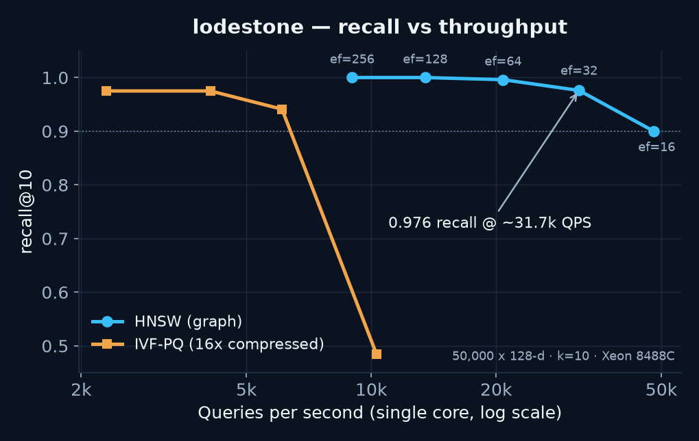

# lodestone

[](https://github.com/iwang-1/lodestone/actions/workflows/ci.yml)
[](.github/workflows/ci.yml)
[](LICENSE)

A from-scratch **vector search engine** in Rust for embedding retrieval and
**RAG** workloads. It implements the two index families that back production
**approximate nearest neighbor (ANN)** systems — an **HNSW** proximity graph and
an **IVF-PQ** compressed inverted file — over **hand-written AVX-512 distance
kernels**, and measures search quality honestly on a **recall@k-vs-QPS** curve
against an exact brute-force oracle. No FAISS, no BLAS: the graph, product
quantizer, k-means, and SIMD kernels are all in-tree.

On 50,000 128-dimensional vectors (single core, one machine, no GPU):

- **HNSW: 0.976 recall@10 at ~31,700 QPS**, reaching **1.000 recall@10** at
  higher `ef` — a **30–48x** speedup over the exact scan at 90%+ recall.
- **IVF-PQ: 0.975 recall@10 at 16x memory compression** (product quantization +
  exact re-ranking of the ADC shortlist).
- **AVX-512 distance kernels** with runtime feature dispatch, differential-tested
  bit-for-close against a scalar reference across every dimension near the
  16-lane boundary.

Every number here is reproduced by `cargo run --release --bin lodestone-bench`
and committed with raw output in [`benchmarks/raw/`](benchmarks/raw/). Numbers
are single-host and CPU-specific; they are honest measurements of this
implementation on the disclosed hardware, not a claim against a tuned production
library.

## Why this exists

Retrieval infrastructure is the substrate under semantic search and RAG, and the
interesting engineering is the recall/latency/memory trade-off: an exact scan is
trivially 100% recall but scales linearly, so real systems approximate — and the
only honest way to talk about an ANN index is a **recall-vs-throughput curve
measured against exact ground truth**. This repository is built around that
measurement. The exact [`BruteForce`](src/index/brute.rs) index is the oracle;
`recall@k` for HNSW and IVF-PQ is defined as set overlap with its output, so the
quality numbers cannot be inflated.

## Results

Host: Intel Xeon Platinum 8488C (48 vCPU, AVX-512), Rust 1.95, single-core query
timing. Corpus: 50,000 × 128-d seeded clustered vectors, 1,000 held-out queries,
k=10. Full raw output: [`benchmarks/raw/bench_50k_128d.txt`](benchmarks/raw/bench_50k_128d.txt).



### HNSW (graph index) — recall@10 vs QPS

| `ef` | recall@10 | QPS (1 core) |
|---:|---:|---:|
| 16  | 0.900 | 48,000 |
| 32  | 0.976 | 31,700 |
| 64  | 0.996 | 20,800 |
| 128 | 1.000 | 13,500 |
| 256 | 1.000 |  9,000 |

The exact brute-force oracle sustains ~1,000 QPS scanning the full corpus in
parallel across 48 cores; HNSW reaches the same recall on **one** core at
13–48k QPS.

### IVF-PQ (compressed index) — recall@10 vs QPS at 16x compression

| `nprobe` | recall@10 | QPS (1 core) |
|---:|---:|---:|
| 1  | 0.485 | 10,300 |
| 4  | 0.941 |  6,100 |
| 8  | 0.975 |  4,100 |
| 16 | 0.975 |  2,300 |

Product quantization stores each vector as 32 bytes instead of 512 (**16x
smaller**); the recall product quantization loses is recovered by exact
re-ranking of a `32k`-candidate ADC shortlist. `nprobe` trades recall for speed
by bounding how many inverted-list cells are scanned.

## How it works

```
                                  query
                                    │
              ┌─────────────────────┼──────────────────────┐
              ▼                     ▼                       ▼
        BruteForce              HNSW graph              IVF-PQ
        (exact oracle)     ┌──────────────────┐   ┌──────────────────────┐
              │            │ upper layers:     │   │ coarse quantizer:     │
    parallel full scan     │  greedy descent   │   │  nprobe nearest cells │
      → exact top-k        │ layer 0:          │   │ posting lists:        │
        (ground truth      │  ef-beam search   │   │  PQ codes (m bytes)   │
         for recall@k)     │ heuristic         │   │  → ADC shortlist      │
                           │  neighbor select  │   │  → exact re-rank      │
                           └──────────────────┘   └──────────────────────┘
                                    │                       │
                                    └──────────┬────────────┘
                                               ▼
                              AVX-512 L2 / inner-product kernels
                              (runtime dispatch, scalar oracle fallback)
```

- **[`distance`](src/distance/)** — L2 and inner-product kernels. On `x86_64`
  the AVX-512 path processes 16 `f32` lanes per fused-multiply-add with a masked
  tail load for any dimension, selected once via `is_x86_feature_detected!`. The
  scalar path is the differential-test oracle.
- **[`index::Hnsw`](src/index/hnsw.rs)** — Malkov & Yashunin (2018): multi-layer
  proximity graph, exponentially-decaying level assignment, greedy descent
  through upper layers, `ef`-width beam search on layer 0, and the paper's
  neighbor-selection heuristic (Algorithm 4), which preserves recall on
  clustered data where plain nearest-M degrades.
- **[`index::IvfPq`](src/index/ivfpq.rs)** + **[`quant::ProductQuantizer`](src/quant/pq.rs)**
  — Jégou et al. (2011): coarse k-means quantizer feeding inverted lists of PQ
  codes, Asymmetric Distance Computation (ADC) via a per-query lookup table, and
  optional exact re-ranking of the shortlist.

## Quickstart

Requirements: a recent stable Rust. AVX-512 is auto-detected at runtime; on a
non-AVX-512 host the scalar kernels are used and every test still passes.

```sh
git clone https://github.com/iwang-1/lodestone.git
cd lodestone

# Unit + differential (AVX-512 vs scalar) + recall tests.
cargo test --release

# Reproduce the results tables (build ~10s, sweep ~1 min):
RUSTFLAGS="-C target-cpu=native" cargo run --release --bin lodestone-bench -- \
    --n 50000 --dim 128 --queries 1000 --k 10
```

Library use:

```rust
use lodestone::index::{Hnsw, HnswParams};
use lodestone::Metric;

let mut index = Hnsw::new(128, Metric::L2, HnswParams::new(16));
for v in &vectors {
    index.insert(v);           // v: &[f32] of length 128
}
// top-10 approximate neighbors; ef trades recall for latency.
let hits: Vec<(u32, f32)> = index.search(&query, 10, 64);
```

## Correctness evidence

- **Differential SIMD test** ([`tests/differential.rs`](tests/differential.rs)):
  the AVX-512 kernels agree with the scalar reference across random vectors and
  every dimension straddling the 16-lane boundary (1, 7, 15, 16, 17, …, 768),
  under a combined absolute+relative tolerance — the last-ULP disagreement is
  floating-point non-associativity from the SIMD tree reduction, not a logic bug.
- **Recall regression test** ([`tests/recall.rs`](tests/recall.rs)): HNSW
  recovers >90% of the exact top-10 at `ef=200`, and IVF-PQ with re-ranking
  recovers a solid majority, both against the brute-force oracle.
- **CI** runs `cargo test`, `cargo clippy -D warnings`, and `cargo fmt --check`.

## Design boundaries

- In-memory indexes; on-disk mmap persistence is not implemented (the raw store
  keeps full-precision vectors in memory for IVF-PQ re-ranking).
- Single static index — no incremental delete/compaction, no concurrent writers.
- Benchmarks use a seeded synthetic clustered corpus (a Gaussian mixture, which
  mirrors real embedding cluster structure) so runs are reproducible without an
  external download; they are single-host, single-core query numbers and must
  not be compared to a distributed vector database.
- k-means uses random-sample seeding rather than k-means++, and a fixed small
  iteration budget; codebook quality (and thus IVF-PQ recall at low `nprobe`) is
  bounded by that choice.

## Repository map

| Path | Responsibility |
|---|---|
| `src/distance/` | L2 / inner-product kernels, AVX-512 + scalar oracle |
| `src/index/brute.rs` | Exact parallel scan (recall ground truth) |
| `src/index/hnsw.rs` | HNSW graph index |
| `src/index/ivfpq.rs` | IVF-PQ compressed inverted file + re-ranking |
| `src/quant/pq.rs` | Product quantizer, k-means, ADC |
| `src/eval.rs` | recall@k against the oracle |
| `src/dataset.rs` | Seeded reproducible clustered corpora |
| `src/bin/bench.rs` | Recall-vs-QPS benchmark harness |
| `tests/` | Differential SIMD + recall regression tests |
| `benchmarks/raw/` | Committed raw benchmark output |

License: [MIT](LICENSE)
